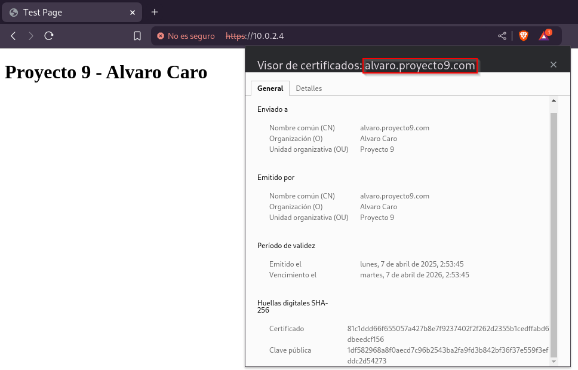
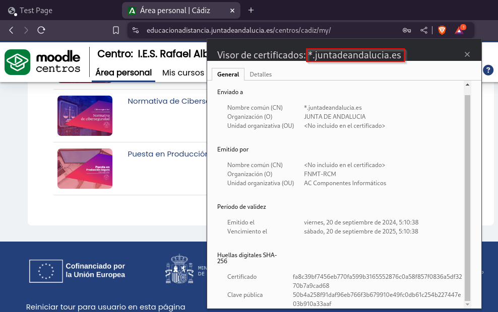

# Parte 2 - Álvaro Caro

## **Certificado autofirmado (alvaro.proyecto9.com)**

- **Enviado a:**
    - **Nombre común (CN):** alvaro.proyecto9.com
    - **Organización (O):** Alvaro Caro
    - **Unidad organizativa (OU):** Proyecto 9

- **Emitido por:**
    - **Nombre común (CN):** alvaro.proyecto9.com
    - **Organización (O):** Alvaro Caro
    - **Unidad organizativa (OU):** Proyecto 9  
    *Nota:* El emisor es el mismo que el destinatario, lo cual es característico de los certificados autofirmados.

- **Periodo de validez:**
    - **Emitido el:** lunes, 7 de abril de 2025, 2:53:45  
    - **Vencimiento el:** martes, 7 de abril de 2026, 2:53:45  

- **Huella digital SHA-256:**
    - **Certificado:** 81c1ddd66f655057a427b8e7f927320f26d2355b1cedffab6d0ecdf156  
    - **Clave pública:** 1df852896a88f40ecd796b2543a2fa9fd3b4e3b56e9fddc264524723  

**Observaciones:**
Los navegadores no consideran confiable este certificado ya que no está validado por una autoridad certificadora (CA). Es adecuado para pruebas locales o entornos internos, pero no para sitios web en producción.

---

## **Certificado verificado (*.juntadeandalucia.es)**

- **Enviado a:**
    - **Nombre común (CN):** *.juntadeandalucia.es
    - **Organización (O):** JUNTA DE ANDALUCÍA
    - **Unidad organizativa (OU):** No incluido en el certificado

- **Emitido por:**
    - **Nombre común (CN):** FNMT-RCM
    - **Organización (O):** AC Componentes Informáticos
    - **Unidad organizativa (OU):** No incluido en el certificado  

- **Periodo de validez:**
    - **Emitido el:** viernes, 20 de septiembre de 2024, 5:10:38  
    - **Vencimiento el:** sábado, 20 de septiembre de 2025, 5:10:38  

- **Huella digital SHA-256:**
    - **Certificado:** fa8c39bf754eb770fa599915285587c0a58f87570836a5dc370b7a9cd68  
    - **Clave pública:** 50b49a52d8fb4c7e4f8c2db4d8d1eaa3b910a33af  

**Observaciones:**
Este certificado ha sido emitido por una autoridad certificadora reconocida (FNMT-RCM), lo que garantiza la confianza y seguridad del sitio web. Es adecuado para sitios públicos y cumple con los estándares requeridos por los navegadores modernos.

---

## **Tabla Comparativa:** Certificado Autofirmado y Certificado Verificado

| **Aspecto**                  | **Certificado Autofirmado**                               | **Certificado Verificado**                                |
|------------------------------|----------------------------------------------------------|----------------------------------------------------------|
| **Nombre común (CN)**        | `alvaro.proyecto9.com`                                   | `*.juntadeandalucia.es`                                  |
| **Organización (O)**         | Alvaro Caro                                             | JUNTA DE ANDALUCÍA                                       |
| **Unidad organizativa (OU)** | Proyecto 9                                              | No especificado en el certificado                        |
| **Emitido por (CN)**         | El servidor (`alvaro.proyecto9.com`)              | FNMT-RCM                                                |
| **Confiabilidad del navegador** | No confiable (autofirmado)                              | Confiable (emitido por una CA reconocida)                |
| **Uso típico**               | Pruebas locales o entornos internos                     | Sitios web públicos y producción                         |
| **Periodo de validez**       | 1 año (7 de abril de 2025 - 7 de abril de 2026)          | 1 año (20 de septiembre de 2024 - 20 de septiembre de 2025) |
| **Huella digital SHA-256**   | `81c1ddd66f655057a427b8e7f927320f26d2355b1cedffab6d0ecdf156` | `fa8c39bf754eb770fa599915285587c0a58f87570836a5dc370b7a9cd68` |
| **Advertencia del navegador**| Sí, muestra "No es seguro"                              | No, el navegador lo reconoce como seguro                 |

---

### **Conclusión**
- El certificado autofirmado es útil para pruebas locales o entornos controlados, pero no es confiable para navegadores porque no está validado por una autoridad certificadora.
- El certificado verificado es emitido por una entidad reconocida (FNMT-RCM), lo que garantiza confianza y seguridad en sitios web públicos.