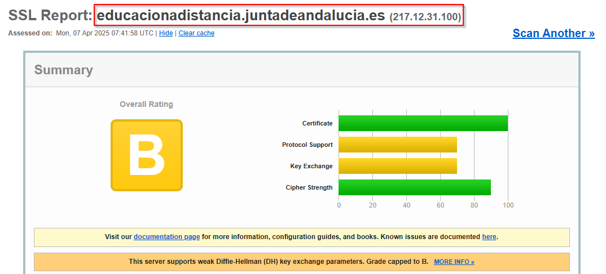
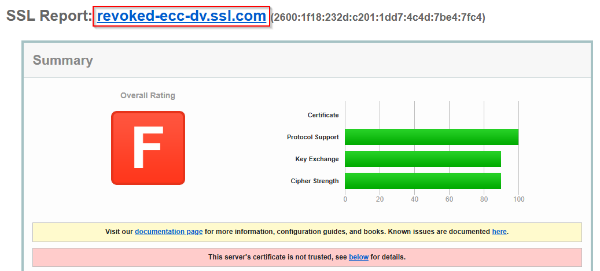
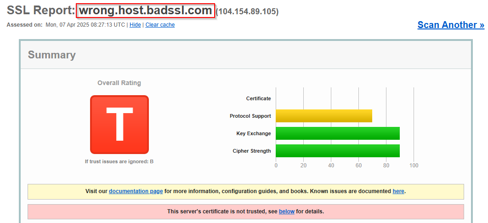
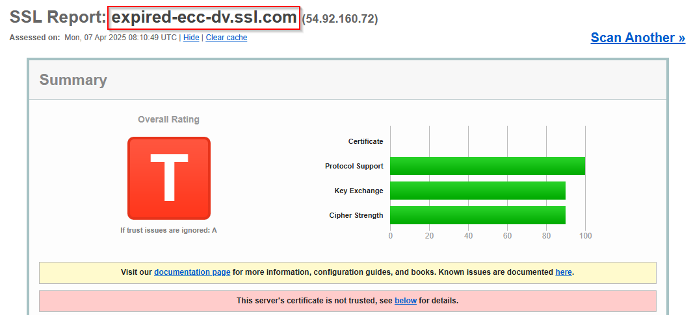

# **Parte 3: Análisis de Certificados SSL/TLS**

## **Certificados válidos**

## 1. Análisis del certificado de `educacionadistancia.juntadeandalucia.es` en SSL Labs

El análisis realizado en SSL Labs para el dominio `educacionadistancia.juntadeandalucia.es` muestra una calificación general **B**, lo que indica que el certificado es válido pero existen aspectos técnicos que limitan su calificación. A continuación, se explican los motivos detrás de esta evaluación:

---

### **1. Certificado**
- **Emitido por**: Una autoridad de certificación confiable.
- **Validez**: El certificado está dentro de su período de validez.
- **Cadena de certificación completa**: Incluye todos los certificados necesarios desde el certificado del sitio hasta el certificado raíz, lo que garantiza la confianza del navegador.

---

### **2. Soporte de protocolos**
- **TLS 1.2**: El servidor soporta TLS 1.2, lo que garantiza un nivel aceptable de seguridad.
- **Compatibilidad**: No soporta TLS 1.3, el protocolo más moderno y seguro disponible actualmente, lo que limita la calificación.

---

### **3. Intercambio de claves**
- **Problema detectado**: El servidor utiliza parámetros débiles para Diffie-Hellman (DH) en el intercambio de claves.
  - Esto reduce la seguridad al permitir posibles ataques contra la negociación de claves.
  - La calificación está limitada a "B" debido a este problema.

---

### **4. Ciphers**
- Los algoritmos de cifrado utilizados son fuertes y actualizados, evitando ciphers débiles o inseguros.

---

### **5. Observaciones adicionales**
- Aunque el certificado es técnicamente válido, las configuraciones del servidor (como el uso de parámetros débiles para Diffie-Hellman) afectan negativamente la seguridad general.

---

### **Motivos para verificarlo como válido**
1. **Certificado confiable**:
   - El certificado está emitido por una autoridad reconocida y dentro de su período de validez.
2. **Cadena de certificación completa**:
   - La cadena incluye todos los certificados necesarios para garantizar la confianza del navegador.

---

### **Motivos para limitar la calificación a "B"**
1. **Parámetros débiles en Diffie-Hellman**:
   - El uso de parámetros débiles en el intercambio de claves reduce la seguridad y expone al servidor a posibles ataques.
2. **Falta de soporte para TLS 1.3**:
   - Aunque TLS 1.2 es seguro, TLS 1.3 ofrece mejoras significativas en rendimiento y seguridad.

---

## **Certificados no válidos**

## 1. Análisis del certificado de `revoked-ecc-dv.ssl.com` en SSL Labs - Certificado revocado

El análisis realizado en SSL Labs para el dominio `revoked-ecc-dv.ssl.com` muestra una calificación general **F**, lo que indica que el certificado no es confiable. A continuación, se explican las razones principales detrás de esta evaluación:

---

### **1. Certificado**
- **Estado**: El certificado ha sido revocado por la autoridad certificadora.
- **Motivo del error**:
  - Los navegadores y herramientas de análisis verifican el estado de los certificados mediante listas de revocación (CRL) o el Protocolo de Estado de Certificados en Línea (OCSP).
  - En este caso, el certificado aparece como revocado, lo que invalida automáticamente su uso.
- **Emisor**: Una autoridad certificadora confiable (SSL.com), pero la revocación invalida la confianza.

---

### **2. Soporte de protocolos**
- **TLS 1.3**: El servidor soporta TLS 1.3, lo que garantiza un nivel alto de seguridad desde el punto de vista técnico.
- **Compatibilidad**: También es compatible con versiones anteriores seguras como TLS 1.2.

---

### **3. Intercambio de claves**
- Utiliza métodos seguros como ECC (Elliptic Curve Cryptography) para el intercambio de claves.
- Aunque este aspecto es técnicamente seguro, no tiene relevancia debido al estado revocado del certificado.

---

### **4. Ciphers**
- Los algoritmos de cifrado utilizados son fuertes y actualizados, evitando ciphers débiles o inseguros.

---

### **Motivos para verificarlo como no válido**
1. **Certificado revocado**:
   - La autoridad certificadora ha revocado este certificado, posiblemente debido a un mal uso, compromiso o solicitud del propietario.
   - Los navegadores modernos rechazan automáticamente certificados revocados y muestran advertencias críticas al usuario.

2. **Falta de confianza**:
   - Aunque los aspectos técnicos son correctos (protocolos, cifrado y claves), la revocación invalida completamente la confianza en este certificado.

---

## 2. Análisis del certificado de `wrong.host.badssl.com` en SSL Labs -  Certificado error coincidencia de nombre

El análisis realizado en SSL Labs para el dominio `wrong.host.badssl.com` muestra una calificación general **T**, lo que indica que el certificado no es confiable debido a un error de coincidencia de nombre. A continuación, se explican los motivos detrás de esta evaluación:

---

### **1. Certificado**
- **Estado**: El certificado no es válido porque el nombre del dominio (`wrong.host.badssl.com`) no coincide con el nombre registrado en el certificado.
- **Dominio esperado**: Según el reporte, el certificado fue emitido para un dominio diferente, probablemente relacionado con `*.badssl.com`.
- **Motivo del error**:
  - Los navegadores verifican que el nombre del dominio solicitado coincida exactamente con el nombre común (CN) o los nombres alternativos del sujeto (SAN) en el certificado.
  - La discrepancia genera una advertencia crítica en los navegadores.

---

### **2. Soporte de protocolos**
- **TLS 1.2 y TLS 1.3**: El servidor soporta TLS 1.2 y TLS 1.3, lo que garantiza un nivel alto de seguridad desde el punto de vista técnico.
- **Compatibilidad**: Aunque los protocolos son seguros, no compensan el error crítico del certificado.

---

### **3. Intercambio de claves**
- Utiliza métodos seguros como RSA o ECDSA para el intercambio de claves, asegurando que las comunicaciones no puedan ser interceptadas ni manipuladas.

---

### **4. Ciphers**
- Los algoritmos de cifrado utilizados son fuertes y actualizados, evitando ciphers débiles o inseguros.

---

### **Motivos para verificarlo como no válido**
1. **Error de coincidencia de nombre**:
   - El certificado fue emitido para un dominio diferente al que se está accediendo.
   - Esto puede ser un indicio de un ataque de intermediario (MITM) o una configuración incorrecta del servidor.

2. **Falta de confianza**:
   - Aunque los aspectos técnicos (protocolos, cifrado y claves) son correctos, la discrepancia en los nombres invalida completamente la confianza en este certificado.

---

## 3. Análisis del certificado de `expired-ecc-dv.ssl.com` en SSL Labs - Certificado expirado

El análisis realizado en SSL Labs para el dominio `expired-ecc-dv.ssl.com` muestra una calificación general **T**, lo que indica que el certificado no es confiable debido a que ha expirado. A continuación, se explican los motivos detrás de esta evaluación:

---

### **1. Certificado**
- **Estado**: El certificado ha expirado, lo que invalida automáticamente su uso.
- **Validez temporal**:
  - Fecha de emisión: No especificada en este resumen.
  - Fecha de vencimiento: Superada, lo que impide su confiabilidad.
- **Emisor**: Una autoridad certificadora confiable (SSL.com), pero la expiración del certificado lo hace no válido.

---

### **2. Soporte de Protocolos**
- **TLS 1.3**: El servidor soporta TLS 1.3, el protocolo más moderno y seguro disponible actualmente.
- **Compatibilidad**: También es compatible con versiones anteriores seguras como TLS 1.2, pero evita protocolos obsoletos como SSLv3.

---

### **3. Intercambio de claves**
- Utiliza métodos seguros como ECC (Elliptic Curve Cryptography) para el intercambio de claves.
- Aunque este aspecto es técnicamente seguro, no tiene relevancia debido al estado expirado del certificado.

---

### **4. Ciphers**
- Los algoritmos de cifrado utilizados son fuertes y actualizados, evitando ciphers débiles o inseguros.

---

### **Motivos para Verificarlo como no válido**
1. **Certificado expirado**:
   - La expiración del certificado invalida su uso, ya que podría haber sido comprometido después de la fecha de vencimiento.
   - Los navegadores modernos rechazan automáticamente certificados expirados y muestran advertencias críticas al usuario.

2. **Falta de confianza**:
   - Aunque los aspectos técnicos son correctos (protocolos, cifrado y claves), la validez temporal es esencial para garantizar la seguridad.

---